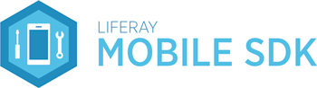

Stable releases and documentation for each of the SDKs are available at the
following links:

- [Download Android and iOS SDKs](../../releases) 
- [Liferay Android SDK documentation](android/README.md)
- [Liferay iOS SDK documentation](ios/README.md)

The Liferay Mobile SDK is a framework for building native mobile apps that
integrate with your different Liferay Portal instances and their portlets. The
SDK provides the means for your mobile apps to easily consume Liferay Portal's
core web services and the web services of your custom portlets. It wraps Liferay
JSON web services, takes care of authentication, makes RESTful requests
(synchronously or asynchronously), parses JSON results and handles server side
exceptions.

The Liferay Mobile SDK is compatible with Liferay Portal 6.2 and
later, and it comes with the Liferay Android SDK and Liferay iOS SDK ready for
you to download and use.

If all you want is to access Liferay's core services from a mobile app, follow
the links above. However, if you want to generate services for your custom
portlet, read the [SDK Builder documentation](builder/README.md).
