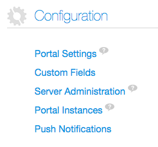

# Liferay Push

* [About](#about)
* [Setup](#setup)
	* [Android](#android)
	* [iOS](#ios)
	* [Test](#test)
* [Use](#use)

## About

The Liferay Push framework is comprised of 3 main components:

* Liferay Push Notifications Portlet
* [Liferay Push Android API](android/README.md)
* [Liferay Push iOS API](ios/README.md)

This document describes how to install and configure the Push Notifications Portlet. This portlet is necessary to enable Liferay Push: it's responsible for making the bridge between mobile apps, your Liferay Portal instance, and Google/Apple Push notifications services.

Once you install it, mobile app users will be able to register their devices against your portal instance. It also provides an API to send push notifications to user devices, any other portlet or portal plugin can use this API to send notifications to mobile apps.

Say for example, you have a blogs portlet and a blogs mobile app that users can use to read posts created by this portlet. You can use Liferay Push to send out new post announcements to all mobile app users. Instead of having to poll the server every few seconds, your app can just wait for announcements: the server will proactively communicate with your app. That's one of the main benefits of using push notifications.

As said above, Liferay Push also has client libraries for [Android](android/README.md) and [iOS](ios/README.md), look at their documentation to see how your mobile app can use the framework.

## Setup

1. Download and install the Push Notification Portlet from the [Liferay Marketplace](link-to-markeplace).
2. Go to your Liferay Portal's Control Panel.
3. Under the `Configuration`, click on the `Push Notifications` link:



4. You should see the `Configuration` tab:


5. Google and Apple Push Notification Services require different properties to be set, check the following sections to understand what these fields mean: [Android](#android) and [iOS](#ios).

You don't need to configure both services. If you are building Android apps only, you just need to configure the Android properties and leave the iOS properties blank or viceversa.

If you don't want to use the UI configuration, you can set properties in the configuration file. In order to do that, you just need to modify the the `portlet.properties` located at the `/push-notifications-portlet/WEB-INF/classes` folder. You need to restart the portal for each change made to this file. Please note that changes made through the UI will always override properties set in `portlet.properties`.

#### Android

This section descibes how to configure the portlet for the Google Cloud Messagging service.
 
**API Key**: The API key is used by this portlet to communicate with the Google Cloud Messaging servers, it's used to authorize the portlet to send notifications to your app. No other server can send notifications to your mobile app if it doesn't have access to these `API Keys`, so keep them secret. Your app must also be configured with a `Sender ID`, it can only get the `registrationId` if the `Sender ID` is linked to this `API Key`. For more information on how to obtain the `API Key`, access [Google's documentation](https://developer.android.com/google/gcm/gs.html) at the `Obtaining an API Key` section.


**Retries**: If the portlet fails to send a notification because the Google Cloud Messaging server is not responding, for example, you can specify how many times it should retry to resend the notification.

##### iOS

This section descibes how to configure the portlet for Apple Push Notification service (APNs). For more information on how this service works, access [Apple's documentation](https://developer.apple.com/library/ios/documentation/NetworkingInternet/Conceptual/RemoteNotificationsPG/Chapters/ApplePushService.html).

There are basically two properties:

**Certificate Path**: You need to generate a p12 certificate that authorizes the portlet to send notifications to the APNs. We recommend you to carefully follow the steps described [here](https://parse.com/tutorials/ios-push-notifications) or [here](http://www.raywenderlich.com/32960/apple-push-notification-services-in-ios-6-tutorial-part-1) to achieve it. After you have generated the .p12 file, store it in your server. The `Certificate Path` property should point to this file in your server.

**Certificate Password**: Use the same password you used during the creation of the certificate you created.

#### Test

You can test if you have configured the portlet properly by clicking on the `Testing` tab:


You can send notifications from there, success or failure messages will show up after you click on `Send`. Look for the server logs as well to see if some exception was thrown.

> Be careful while testing don't do this in production as it will send messages to all registered devices. All the users that are using your mobile app will receive it. This should be tested during development only.

## Use

In order to use the Push Notifications API in your own portlet, you need add the push-notifications-portlet as a dependency to your portlet, inside `docroot/WEB-INF/liferay-plugin-package.properties`:

```
required-deployment-contexts=\
	push-notifications-portlet
```

In order to send a notification, you can call:

```java
PushNotificationsDeviceLocalServiceUtil.sendPushNotification(toUserId, notificationJSONObject);
```

The portlet will look for all devices registered for `toUserId` and send the `notificationJSONObject` to each device. In case you want to send the same notification to all users, there's another version of this method that has no `toUserId`.


